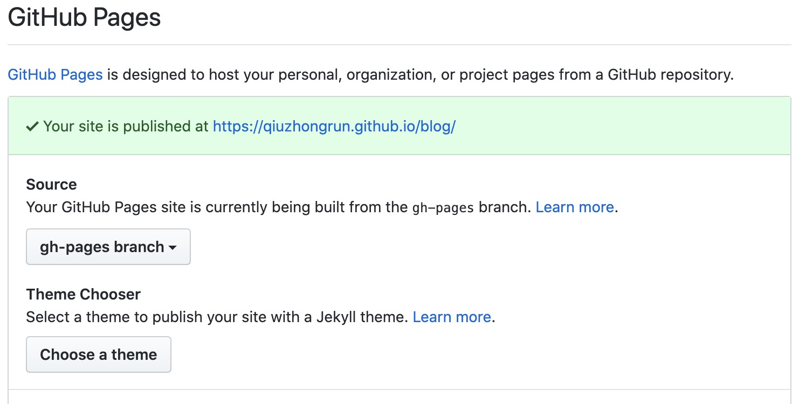

::: tip
* vuepress好看
* Github Pages配合github好管理
* travis-ci足够自动化

所以选择vuepress + Github Pages + travis-ci 搭建一个个人博客。
:::

很幸运的是，有一个我喜欢的主题[vuepress-theme-reco](https://vuepress-theme-reco.recoluan.com/)。作为一个前端freshbird，它能最大程度地减少我的掉毛数。下面的搭建过程就以这个主题展开。以我自己的工程blog举例。

@flowstart ant
st=>start: Start
e=>end: 通过访问https://qiuzhongrun.github.io/blog访问到博客内容
op_github_repo=>operation: 创建一个github项目blog
op_vuepress_project=>subroutine: 根据vuepress-theme-reco创建出vuepress工程blog
op_hook=>operation: github端配置好Github Pages的钩子
op_ci=>parallel: travis-ci自动构建推送到Github Pages

st->op_github_repo->op_vuepress_project->op_hook->op_ci->e
@flowend

# 创建github工程
打开官网主页[Github Pages](https://pages.github.com/)，你会发现它的教程其实很详细，这里不赘述。这里讨论的是它的两种方式，[User or organization site]和[project-site]注意，如果没搞清楚这两个，后面你会很困惑的。

下面主要讲一下关于Github Pages配置的区别：project → Settings → GitHub Pages
### User or organization site
以个人或者组织的角度，全新创建一个<span style="color: red;">github.io</span>为结尾的github工程。注意前面红色的字，如果你一旦以<span style="color: red;">github.io</span>为结尾创建工程，然后你会惊奇地发现Github Pages配置时无法选择展示的Source了。

这个意思是说以后你去访问https://username.github.io/blog访问到的只能是master分支的内容，这会带出一个很棘手的问题：“为何我什么都配置了，最后只能显示master代码分支的README.md文件，不是预期的gh-pages分支里的静态文件?”。

解决的办法也有，那就是顺着它的思路，使用mater分支当做build后静态资源存放的分支，代码分支放到别处去。参考[拯救懒癌文档君 - VuePress + Travis CI + Github Pages 自动线上生成文档](https://juejin.im/post/5d0715f6f265da1ba56b1e01),我被伤到了，这种方案我就不细说了。
::: warning
这种方式的工程一般在Github Pages配置的时候，需要选择主题。
:::

### project-site
以工程的角度来创建一个专门展示工程，这里就可以选择分支了。切记工程名不要是<span style="color: red;">github.io</span>为结尾。

gh-pages分支是Github Pages约好的分支，这个后面travis-ci推送的时候会自动创建。这个方式不单只可以创建新的工程的时候适用，老工程也同样适用。
::: warning
这种方式的工程在Github Pages配置的时候，不要选择主题，因为我们用的是vuepress的主题。
:::

# 根据vuepress-theme-reco创建出vuepress工程
1. 下载空github工程
``` sh
# 注意你clone你自己的路径哈，下面这个是我的举例
git clone https://github.com/qiuzhongrun/blog.git

# 进入工程
cd blog
```
2. 初始化vuepress工程
在主题的[Github地址](https://github.com/vuepress-reco/vuepress-theme-reco)有很清晰的初始化方式，下面贴出我的。
``` sh
# 添加theme-cli工具
yarn global add @vuepress-reco/theme-cli

# 请注意这里的 . 意思是当前blog目录下
theme-cli init .

# install 
yarn install

# run
yarn dev

# build
yarn build
```
在theme-cli工具init一个工程的时候，会让你选style，我选了afternoon-grocery，会带来很多已存在的文章，但是也给了很多我参考，后续删除即可。
``` sh
? What's the title of your project? blog
? What's the description of your project? 个人博客
? What's the author's name? Qiu Zhongrun
? What style do you want your home page to be?(Select afternoon-grocery, if you want to download reco_luan's '午后南杂')
  blog
  doc
❯ afternoon-grocery
```
3. 修正偏差
①添加base
②修改title
③修正dest目标路径为docs/.vuepress/dist
``` javascript
module.exports = {
  base: '/blog/', # ①添加base, 为了后面访问的时候有上下文，没有这玩意儿，你访问就会出问题
  title: "欢迎你，这是我的博客！", # ②修改title，自己看着办哈
  description: 'Enjoy when you can, and endure when you must.',
  dest: 'docs/.vuepress/dist', # ③修正dest目标路径为docs/.vuepress/dist，这个必须和稍后的自动部署的local_dir保持一致
  head: [
    ['link', { rel: 'icon', href: '/favicon.ico' }],
    ['meta', { name: 'viewport', content: 'width=device-width,initial-scale=1,user-scalable=no' }]
  ],
  theme: 'reco',
  themeConfig,
  markdown: {
    lineNumbers: true
  },
  plugins: ['@vuepress/medium-zoom', 'flowchart'] 
} 
```

# travis-ci部署
参考这里的[自动部署](https://vuepress-theme-reco.recoluan.com/views/other/deploy.html#%E8%87%AA%E5%8A%A8%E9%83%A8%E7%BD%B2)，这里不展开讲，只讲一些注意点。
1. build命令里面写的是`npm run build`，如果你看着不顺眼，可以修改为`yarn build`意思是一个意思。
2. 设置token的时候，除了delete repo的权限不给，其他都给上吧。
3. 授权travis-ci Manage repositories on GitHub的时候，不要全选，就选你要的就行
4. 要在https://github.com/qiuzhongrun/blog/settings，也就是你的github repository的Settings里修改Github Pages的Source为gh-pages，这个分支你可以自己建，也可以等第一次跑完travis-ci它自动创建好后再选。


到此，只要push一次代码，就会触发travis-ci自动build，推送到指定分支(gh-pages)，然后你在https://qiuzhongrun.github.io/blog就可以访问到了。

# 后记
后续使用的时候，发现一些问题，这里也记录下来以供参考。

### 热部署Hot Reload
没错，vuepress 1.x这个功能是有问题的，在这个[#issue](https://github.com/vuejs/vuepress/issues/1283)里有讲，至今未见关闭。
解决办法也有多人提出多种方案，我采用[pepsifan](https://github.com/pepsifan)提出的nodemon解决方案，亲测有效。
下面是[pepsifan](https://github.com/pepsifan)的方案：
1. 安装nodemon
``` sh
npm i -D nodemon
```
2. 修改package.json，增加命令
``` javascript
  "scripts": {
    "test": "echo \"Error: no test specified\" && exit 1",
    "dev": "vuepress dev docs",
    "build": "vuepress build docs",
    "start": "nodemon --ext md,vue --watch .vuepress --watch . --exec vuepress dev docs" # 新增的启动命令
  },
```
3. start启动
``` sh
yarn start
```
这个方案监控了.vue和.md文件的变动，会触发vuepress工程reload，浏览器刷新可见新内容。

